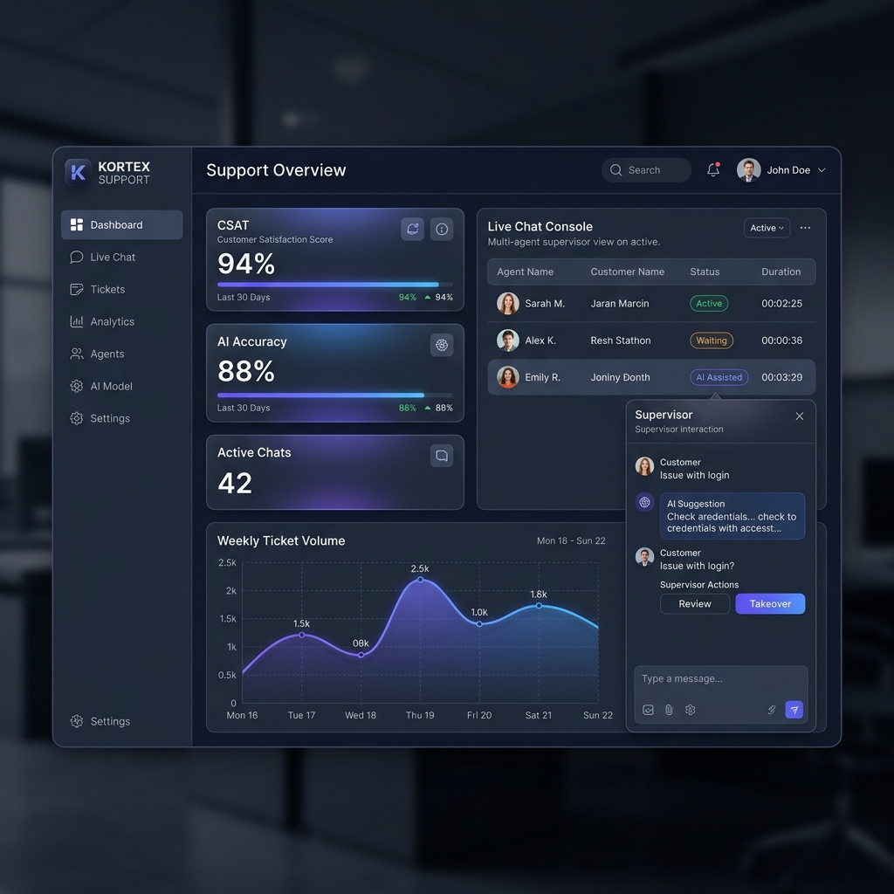

# Kortex Support - AI Customer Support Platform



An enterprise-grade, multi-tenant AI Customer Support Platform featuring a premium SaaS landing page, robust authentication, interactive dashboard, multi-agent chatbot console, knowledge base management (RAG), ticket system, CRM integrations, visual workflow builder, and fine-tuning/training logs.

## Technology Stack

- **Frontend**: React, Vite, TypeScript, Tailwind CSS v4, Framer Motion, Recharts
- **Backend**: FastAPI (Python), LangGraph (Agent orchestration), LangChain (RAG)
- **Database**: SQLite (local testing) / PostgreSQL
- **Orchestration**: Docker Compose

---

## Developer Documentation

Detailed API specs are available in [API_DOCUMENTATION.md](API_DOCUMENTATION.md).

---

## Getting Started

### Method 1: Local Standalone Mode (Run Frontend Only)
The frontend is designed to work in a fully functional **Standalone Mode** by default. It simulates all agent routing, ticket statuses, Stripe refunds, sitemap crawling, and workflow builders directly inside the browser using local storage state managers.

1. Navigate to the frontend directory:
   ```bash
   cd frontend
   ```
2. Install npm dependencies:
   ```bash
   npm install
   ```
3. Launch the local Vite dev server:
   ```bash
   npm run dev
   ```
4. Open [http://localhost:5173](http://localhost:5173) in your web browser.

---

### Method 2: Python Backend Setup & Testing
1. Navigate to the backend directory:
   ```bash
   cd backend
   ```
2. Install pip dependencies:
   ```bash
   pip install -r requirements.txt
   ```
3. Run the API test suite using pytest:
   ```bash
   python -m pytest
   ```
4. Start the FastAPI development server:
   ```bash
   python main.py
   ```
5. Access the API documentation (Swagger) at [http://127.0.0.1:8000/docs](http://127.0.0.1:8000/docs).

---

### Method 3: Containerized Deployment (Docker Compose)
To run the complete front-to-back setup together inside Docker:

1. Build and boot up all service containers:
   ```bash
   docker-compose up --build
   ```
2. Access the unified services:
   - Frontend SPA Portal: [http://localhost:3000](http://localhost:3000)
   - Backend API Docs: [http://localhost:8000/docs](http://localhost:8000/docs)

---

## Multi-Agent Supervisor Routing Architecture

The platform uses a **Supervisor Agent** to analyze incoming customer tickets or chat queries, check vectors for similarity contexts, and route the customer to one of the following specialist agents:
- **Technical Support Agent**: Troubleshooting SDK configurations, CORS parameters, and integration endpoints.
- **Billing Agent**: Adjusting subscriptions, credit adjustments, and seat charges.
- **Refund Agent**: Processing automatic Stripe refunds for damaged packages under the 30-day window.
- **Order Tracking Agent**: Syncing WooCommerce/Shopify carrier tracking details.
- **General Support Agent**: Handling general FAQs and documentation searches.
